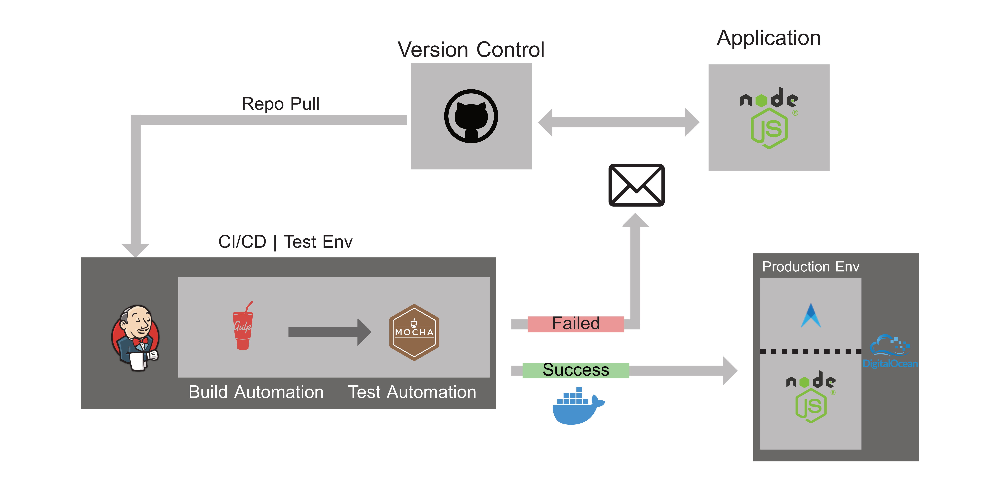

## Describe automation processes & application lifecycle

1. Die React App mit dem Jenkinsfile wird auf einen gesonderten "deploy" branch gepusht
2. Jenkins horcht auf diesen Branch pulled diesen und liest das Jenkinsfile aus sobald ein update verfügbar ist
3. Nach dem auslesen des Jenkinfiles startet Jenkins einen build
4. Jenkins startet GULP, um die dependencies zu fetchen
5. Jenkins startet Mocha.js und führt die Tests aus
6. Sollte der Build failen wird der Entwickler informiert
7. Ist der Build Succeded wird das Dockerfile im Projekt ausgelesen und ein Docker Container und Image erstellt
8. Jenkins deployed die App auf Digital Ocean
9. Cabot überprüft den status der Applikation auf Digital Ocean

## Outline architecture of the infrastructure

//TEST
## Explain your decisions

Wir verwenden...

- **GitHub**, weil es kostenfrei, weitverbreitet und Erfahrungswerte vorhanden sind
- **Jenkins** weil es kostenfrei und weitverbreitet ist, sowie einen guten community support und unbegrenzte erweiterungsmöglichkeiten bietet
- **Gulp** ???
- **Mocha.js**, weil es eine sehr einfache implementierung bietet
- **Docker** unterstützt von den prominentesten CI Lösungen, beschleunigt den provisioning prozess
- **Cabot** self-hosted, einfach zu deployen und alter service 

briefly describe the technology stack you opted for
